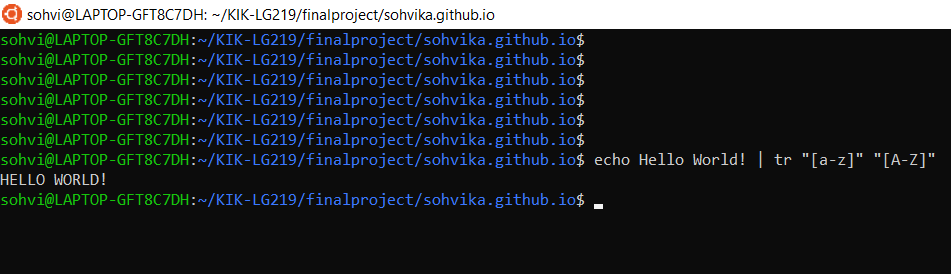

## Command Line for Linguists

This course is a bachelor-level course designed for linguists interested in language technology, helping them to familiarize themselves with working from the command line. The course uses Linux's command line, and is customized to suit the needs of linguists. 

The course was structured by weekly themes, and teaching videos and reading materials were provided for every theme. The evaluation of the course happened through weekly quizzes and assignments on the respective themes, and a final project of creating a GitHub page, of which you are reading an example of. 

### Week 1: Introduction to Command Line Environments

The first week of the course dealt with the basics of working in a command line environment, like setting up the command line and navigating the very basics of commands that can be used, like `less life_of_bee.txt` which allows the user to read a text file in the shell, or `emacs life_of_bee.txt` where the text file could be modified in the text editor called `emacs`.  

This was the first plunge into the world of the Linux command line, I had previously only used the one of Windows, so relearning some of the different command took a bit of time, but the experience was pleasant and exciting, and made me look forward to the remainder of the course. 

### Week 2: Navigating a UNIX System

The second week delved deeper into the basics of command line, and also introduced us to exploring the file system and file permissions (and how to change them). This can be done with the command `chmod`, like with the example of `chmod 666 hello_world.txt` where read and write permissions are added to all users and guests for that particular text file. We were also taught how to run processes in the background, and kill them if necessary. The third and final topic was how to connect to and work on a remote server. 

From this week's lessons the ability to change permissions went on to be the most useful topic during the rest of the course. Working in a remote server might be useful in the future as well, but for now using GitHub repos seem to make more sense. 

### Week 3: Basic Corpus Processing

The third week was on the topics of character encodings, where the command `dos2unix` was especially helpful due to its ability to transform a Windows-style text file to one that Unix(Linux) can read easier, text file processing (with commands like `sort` which sorts words alphabetically and numbers numerically and `tr` which can translate words or characters to the desired outcome, like `echo Hello World! | tr "[a-z]" "[A-Z]"` that would transform the Hello World! into HELLO WORLD!), and regular expressions that help with commands like `tr` and `egrep`. 



Most of the commands learnt during this week were used often later on in the following weeks as well, and were more suited for linguistic tasks that would require the aid of technology. 


### Week 4: Advanced Corpus Processing

The fourth week was for finetuning and easing corpus processing learnt the previous week. The new command `sed` was used for multiple purposes, like deletting lines and finding and replacing patterns. We were taught to use pipelines to combine multiple commands, and how to make frequency lists, sentence-per-line formatted texts and n-grams out of texts. One possible way of forming a frequency list would be `cat life_of_bee.txt | tr -s '\n\t\r ' '\n' | tr -dc "A-Za-z0-9'\n" | sort | uniq -c | sort -nr`, which would provide  a list of the words in that text in a list with the amount of times they appear in the text in the order of most frequent to least. This would provide a list beginning like this:

Frequency | Word
--- | ---
4595 | the
2556 | of
1840 | and
1631 | to
1155 | that
1035 | in

This week's topics have proven to be useful in other studies as well, where especially making frequency lists and n-grams out of texts have been useful (like n-grams in Word Sense Disambiguation tasks). These are the tools that I know will be needed outside of this course as well, which is always pleasant. 


### Week 5: Scripting and Configuration Files

The fifth week was on the theme of scripts and configuration files, and we were taught how to create and modify both of those. We learnt how to use `if` in scripts, and how to incorporate our scripts into configuration files. An example of a bash script made for taking a directory name as its input, then loops through all files and directories (except the hidden ones) in that directory and prints their names in a list would look like this:
```
for f in $1 ;
do
  ls -1 *
done
```

The topic of scripts was a tougher one for me, as it felt like a huge leap from the previous topics, but fortunately with some more independent practicing it is looking clearer now. 


### Week 6: Installing and Running Programs

The sixth week was all about different kinds of installations. We learnt how to become the root user to be able to install programs and packages for the whole operating system, and installed and updated programs and different libraries for them with `apt-get`. We used Python in the command line and used `pip`to install Python modules within itself. We also learnt how to create and run Makefiles. An example of a Makefile that creates frequency lists and sentence-per-line formatted versions of all the given texts, and also creates a combined text in sentence-per-line format where all the given books are, and creates a frequency list of all of the words in all of the texts together looks like this:

```
BOOKS=alice christmas_carol dracula ulysses frankenstein heart_of_darkness life_of_bee moby_dick modest_propsal pride_and_prejudice tale_of_two_cities

FREQLISTS=$(BOOKS:%=results/%.freq.txt)
SENTEDBOOKS=$(BOOKS:%=results/%.sent.txt)
ALLFREQ=$(BOOKS:%=results/all.freq.txt)
ALLSENT=$(BOOKS:%=results/all.sent.txt)


all: $(FREQLISTS) $(SENTEDBOOKS) $(ALLFREQ) $(ALLSENT)

clean:
        rm -f results/* data/*no_md.txt

%.no_md.txt: %.txt
        python3 src/remove_gutenberg_metadata.py $< $@

data/all.no_md.txt: $(BOOKS:%=data/%.no_md.txt)
        cat $^ > $@

results/%.freq.txt: data/%.no_md.txt
        src/freqlist.sh $< $@

results/%.sent.txt: data/%.no_md.txt
        src/sent_per_line.sh $< $@
```

This week felt good after the previous week's feelings of despair, as this felt much more understandable and logical. These Python modules and Makefiles also both seemed very useful for the future studies and projects.  


### Week 7: Version Control

The seventh week marked the last regular week of new topics, and introduced us to the mysteries of Git. We learnt how to use version control with Git, and how to push our changes to Github to be possibly shared with other people. We also learnt how to work on separate branches in case of trying something new and risky, and how to combine those branches to the master branch. 

The steps to take when making changes to your project and wanting to make this change permanent (or at least semi-permanent) are:
1. `git status`to see what changes have been made
2. `git add .` to add all the current changes to the next commit
3. `git commit -m "<here what you have changed>"` to commit the changes and tell what has changed
4. `git pull origin master` to get possible changes made in the remote repository, the `origin` and `master` can be changed to match the remote repo and branch names that you are working on
5. `git push origin master` to push the changes into the remote repository.

Using version control was not something I really did previously, so learning to use it during this week and while doiong this final project helped me to familiarize myself with it and commit to using it in the future. 

