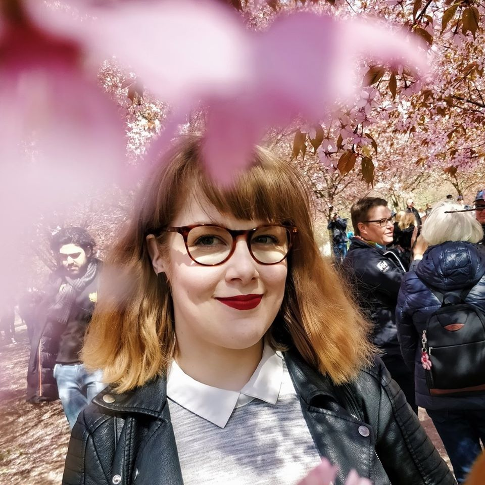

## Introduction

 First year Language Technology student in the master's program Linguistic Diversity in the Digital Age of University of Helsinki. Background in language learning and teaching, namely with English, French, and other Romance languages. Main interests are language learning technologies and speech recognition as a tool for learning and accessibility. 

Hobbies and pastimes include cooking, baking, listening to true crime podcasts, karaoke and starting (and quitting) new sporting hobbies regularly. 

## Find me on

[GitHub](https://github.com/sohvika)

## Contact

My email address is of the form first_name.last_name@helsinki.fi. 

## Curriculum Vitae

[My up-to-date CV can be found here](https://www.overleaf.com/read/syzkwjrmvzcm)

## Courses I've Taken

[COMMAND LINE TOOLS FOR LINGUISTS](https://courses.helsinki.fi/en/kik-lg219/129824412), fall 2019

[DIVERSITY AND VARIATION](https://courses.helsinki.fi/en/lda-3102/130805771), fall 2019

[INTRODUCTION TO SPEECH ANALYSIS](https://courses.helsinki.fi/en/kik-lg212/129824127), fall 2019

[LINGUISTICS IN THE DIGITAL AGE](https://courses.helsinki.fi/en/lda-3103/130805706), fall 2019

[THEORY AND METHOD IN LANGUAGE SCIENCES](https://courses.helsinki.fi/en/lda-3101/130805385), fall 2019

## Projects

[Training repo for the command line course](https://github.com/sohvika/cmdline-course)

## Misc. 

[My Favourite Murder -podcast on Spotify](https://open.spotify.com/show/0U9S5J2ltMaKdxIfLuEjzE) 

[My most used recipe blog Chocochili](https://chocochili.net/)
